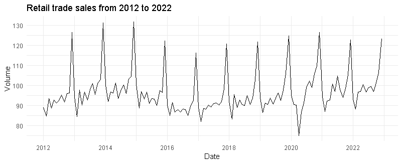

# Predicting Brazil's retail trade sales time series in R
In this work, i'll analyze the retail trade sales in brazil from **2012** to **2022** and choose the best fit model to predict 2023 sales.
####
#### 1. Taking a look at the time series

######
Analyzing the plot of the series, we can easily visualize that it has a seasonality. It's also indicating to us that we may choose a SARIMA model.
######
#### 2. Testing the equality of variances with the Levene's test
Even though the series seems to have a constant variance, we still should do the Levene's test to check the variance equality through the series.
- **$$H_{0}: \theta_{0}^{2}=\theta_{1}^{2}=...=\theta_{k}^{2}$$,**
- **$$H_{1}: \theta_{i}^{2}\neq\theta_{j}^{2}$$ for at least one pair $$(i,j)$$.**
######
Testing the hypothesis for $$k=2$$ (dividing the series in half), it resulted in a p-value of **$$0.6758$$**. It means that we didn't find evidences that the variances of the two groups are different from each other.
######
#### 3. Analyzing the ACF and PACF plots
