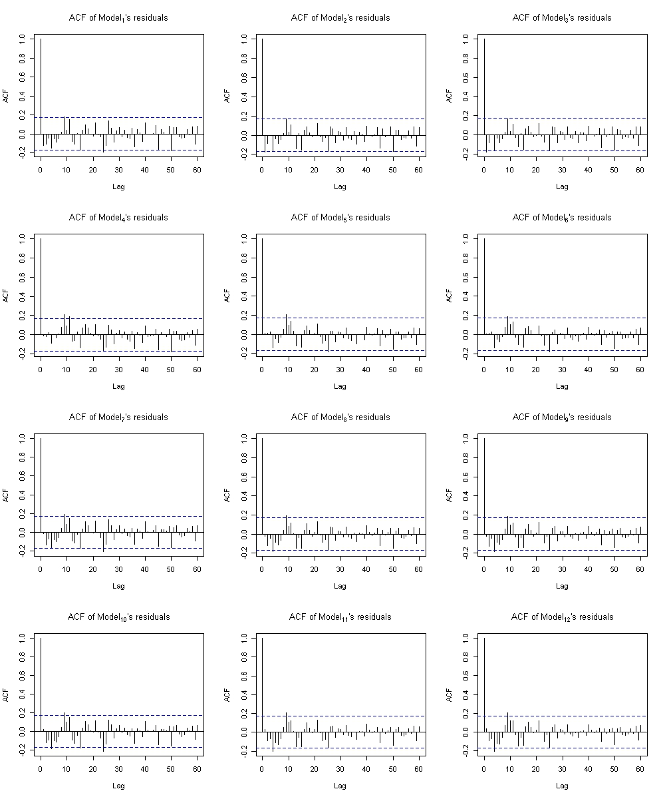

# Forecasting Brazil's retail trade sales time series in R
In this work, i'll analyze the retail trade sales in brazil from **2012** to **2022** and try to choose the best statistical model to forecast 2023 sales. As a convention, for the hypothesis testing, i'll set the significance level in 5%.
####
#### 1. Taking a look at the time series

######
Analyzing the plot of the series, we can easily visualize that it has a seasonality of 12 months (S = 12) and looks like it doesn't have a trend. Then we can try a SARIMA $$(p,d,q)(P,D,Q)_{S}$$ model in this case.
######
#### 2. Testing the equality of variances with the Levene's test
Even though the series seems to have a constant variance, we still should do the Levene's test to check the variance equality through the series.
- **$$H_{0}: \theta_{1}^{2}=\theta_{2}^{2}=...=\theta_{k}^{2}$$,**
- **$$H_{1}: \theta_{i}^{2}\neq\theta_{j}^{2}$$ for at least one pair $$(i,j)$$.**
######
Testing the hypothesis for $$k=2$$ (dividing the series in half), it resulted in a p-value of **$$0.6758$$**. It means that we didn't find evidences that the variances of the two groups are different from each other.
######
#### 3. Analyzing the ACF and PACF plots

######
#### 4. Trying to figure out the parameters
######
To get rid of the seasonality peaks we can take one difference of the seasonality part (D = 1).
######

######
The resulted plot is indicating to us that the series is non-stationary. A simple differencing, d = 1, may estabilise the series.
######

######
Now with the series stabilised, let's take a look on the resulted ACF and PACF plottings.
######

######
The plottings are indicating to us that we may choose one of the models below:
- $$Model_{1}$$: SARIMA $$(0,1,0)(1,1,0)_{12}$$,
- $$Model_{2}$$: SARIMA $$(0,1,0)(0,1,1)_{12}$$,
- $$Model_{3}$$: SARIMA $$(0,1,0)(1,1,1)_{12}$$,
- $$Model_{4}$$: SARIMA $$(1,1,1)(1,1,0)_{12}$$,
- $$Model_{5}$$: SARIMA $$(1,1,1)(0,1,1)_{12}$$,
- $$Model_{6}$$: SARIMA $$(1,1,1)(1,1,1)_{12}$$,
- $$Model_{7}$$: SARIMA $$(1,1,0)(1,1,0)_{12}$$,
- $$Model_{8}$$: SARIMA $$(1,1,0)(0,1,1)_{12}$$,
- $$Model_{9}$$: SARIMA $$(1,1,0)(1,1,1)_{12}$$,
- $$Model_{10}$$: SARIMA $$(0,1,1)(1,1,0)_{12}$$,
- $$Model_{11}$$: SARIMA $$(0,1,1)(0,1,1)_{12}$$,
- $$Model_{12}$$: SARIMA $$(0,1,1)(1,1,1)_{12}$$.
######
Talking about the models selected, since both ACF and PACF are truncated in lag 12, we should test models with all the combinations of P = 1 and Q = 1. The models with p = 1 and q = 1 are on the list because it seems like the first lags of ACF and PACF are significant, so we're trying all the combinations of it too.
######
#### 5. Comparing the models
######
Before comparing the models, we should know if the residuals of the models are, approximately, normally distributed. We can do this by looking at the Histogram, Density an Q-Q plots.
######

######
The Histogram and Density plots are indicating to us that the residuals of the models are approximately normally distributed. We could've done the Shapiro-Wilk's test to analyze if the residuals are normally distributed, but i choose not to do this test due to the fact that it is highly sensitive to small deviations from normal distribution in large samples. Now, let's take a look at the Normal Q-Q Plots.
######

######
We can visualize in the plots that the data points are very close to the normal line, with some differences in one or another model. Because of these Normal Q-Q plots and the histogram plots, we can consider that the residuals of the models are normally distributed.
######
The first thing we can do to compare the models is to do the Ljung-Box test for each model. With that, we can assure the model's residuals independence, but before that we need to know where the lags of the ACF for each model's residuals crosses the lines of statistical significance.
######

######
Since it's difficult to actually know if the ACF did or didn't cross the line because some of the points are very close to the line, we can make a graph of all the resulted p-values for the first 50 lags for each model. Calculating the p-values, we have the this graph:
######

######
The hypothesis of the Ljung-Box test are defined as:
- **$$H_{0}$$: The model doesn't exhibit lack of fit,**
- **$$H_{1}$$: The model exhibits lack of fit.**
######
In this graph, if the resulted p-value is less than 0.05, then the square is in red. It looks like the models with p = 1 and q = 1 (model 4, model 5 and model 6) are the only ones that the null hypothesis didn't get rejected, it means that we didn't find evidences that these models exhibit lack of fit. So because of that, we can continue our comparison of models only with them.
######
| Model | AIC | BIC |
| --- | --- | --- |
| $$Model_{4}$$ | 634.32 | 645.44 |
| $$Model_{5}$$ | 622.65 | 633.77 |  
| $$Model_{6}$$ | 623.33 | 637.23 |
######

